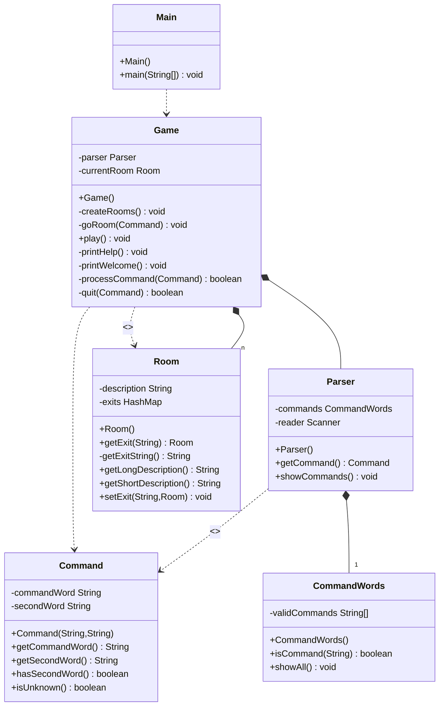
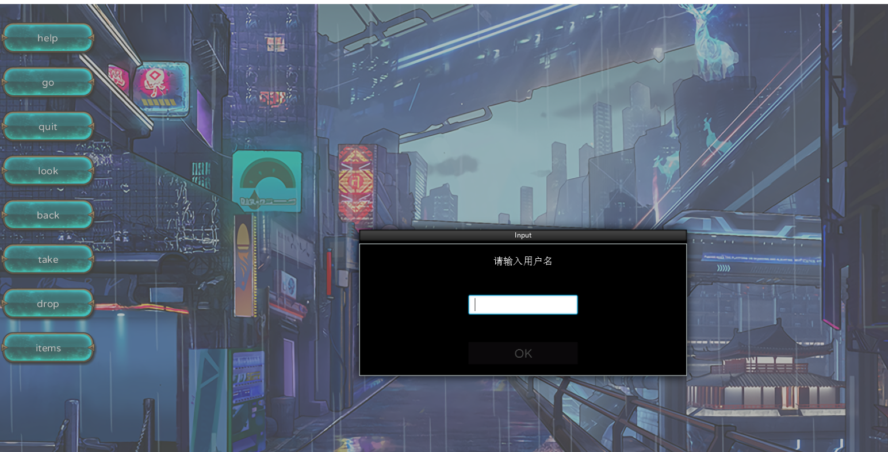
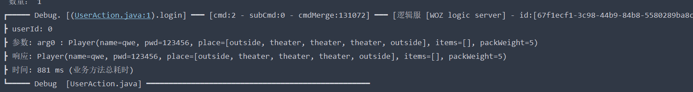

# 软件工程实训任务一：代码规范与标注

## 以UML图表示的样例工程软件结构

- 下图是对样例工程的代码结构分析，以类图形式呈现
  (使用mermaid语法，github可能渲染不出`<<create>>`)。



- 精读样例工程软件代码，可以得到系统用例图如下

.png)

## 标注样例工程中的代码

- 本任务中代码的标注见具体文件。

- 代码规范环节参考`Alibaba Java Coding Guidelines`
  - 原样例工程就比较规范，规范提示的内容就是一些行尾注释，某些地方必须使用`javadoc`注释
  - 在这一步中，类似`commandWord.equals("help")`的代码被建议修改成`"help".equals(commandWord)`，不过都在下一步中被重构了

## 扩充和维护样例工程

1. `Game`类的`processCommand()`中的`if else`重构
   - 样例工程的这一处是应对不同的参数走不同的逻辑的场景。
   
   - 所以解决思路就是使用策略模式
   
     - 针对一组算法，将每一个算法封装到具有共同接口的独立的类中，使得它们可以互换。
   
     - 使用map存储完成相应算法的不同对象，使用时根据getStrategy传入type即可获得相应的对象，伪码如下
   
       ```java
       public class StrategyFactory {
         private static final Map<String, Strategy> strategies = new HashMap<>();
       
         static {
           strategies.put("A", new ConcreteStrategyA());
           strategies.put("B", new ConcreteStrategyB());
         }
       
         public static Strategy getStrategy(String type) {
           return strategies.get(type);
         }
       }
       ```
   
     - 本项目中运用到策略模式来发送不同的命令及作出响应，具体可以查看`game-front-end`模块中`com.xf.woz.client.net`包下的`UserWebsocketClient`和各种`OnMessage`实现
   
2. 一些改进点

   1. 获取房间的出口，原代码写法是

      ```java
      String returnString = "Exits:";
      Set<String> keys = exits.keySet();
      for(String exit : keys) {
          returnString += " " + exit;
      }
      ```

      改用StringBuilder完成

      ```java
      StringBuilder returnString = new StringBuilder("Exits:");
      Set<String> keys = exits.keySet();
      for(String exit : keys) {
          returnString.append(" ").append(exit);
      }
      ```


## 功能扩充点

> 本项目完成了8个参考的功能扩充项，以下是实现说明

1. 首先是物件的存放。

   1. Item类(物件)设置如下

      ```java
      public class Item {
          private String name;//物件的名字
          private String description;//描述
          private int weight;//重量值
      }
      ```

   2. 在游戏中，程序会访问服务器并根据返回信息一次性加载所有房间中存在的物件(详细见`com.xf.woz.util.FXGLUtils.java:77`)

      ```java
      LookOnMessage.me().request(FXGLUtils.outside);
      LookOnMessage.me().request(FXGLUtils.pub);
      LookOnMessage.me().request(FXGLUtils.magic);
      LookOnMessage.me().request(FXGLUtils.office);
      LookOnMessage.me().request(FXGLUtils.theater);
      LookOnMessage.me().request(FXGLUtils.lab);
      ```

   3. 在加载完成后，玩家点击look按钮，就会将(当前房间)加载的内容展示出来，具体实现如下
      `com.xf.woz.WorldOfZuulApp.java:205`

      ```java
      List<String> place = FXGLUtils.nowPlayer.getPlace();
      nowPlace = place.subList(place.size() - 1, place.size()).get(0);
      List<String> lookTalks = List.of("You are in the " + nowPlace + ".",
                                       "You can see:" + FXGLUtils.roomItems.get(nowPlace));
      List<Talk> talks4 = TalkFactory.buildTalkList(lookTalks);
      TalkScene.getInstance().show(talks4);
      ```

2. "back"命令的实现

   1. 在玩家登录之后，客户端会接受到一个完整的Player对象，对应的类设置如下

      ```java
      public class Player {
          private String name;
          private String pwd;
          private List<String> place;
          private List<String> items;
          private int packWeight;
      }
      ```

   2. `Player`对象其中的属性`List<String> place`，记录玩家所有经过的地方
      那么根据"back"命令的逻辑，返回的房间就是`place`中的倒数第二个值

   3. 根据上述分析，代码实现为

      ```java
      public static void backRoom() {
          List<String> place = nowPlayer.getPlace();
          if (place.size() == 1) {
              //如果回到了最初的房间会给出提示
              FXGL.getNotificationService().pushNotification("We're back in the original room.");
              return;
          } else {
              place.remove(place.size() - 1);
          }
          updateRoom(place.remove(place.size() - 1));
      }
      ```

3. 更高级的“back”命令：同2，代码实现也是同一份，不再赘述

4. 传输功能的房间

   1. 首先，传输功能的房间也是房间，所以先按照其他房间一同设置逻辑

   2. 进入房间的逻辑("go" 命令)

      ```java
      public static String newRoom(String name, String dir) throws NoSuchFieldException, IllegalAccessException {
          Field oriRoom = FXGLUtils.class.getDeclaredField(name);//通过反射获取房间对象
          Room o = (Room) oriRoom.get(null);
          return o.getExit(dir).getName();//从某个出口进入新房间
      }
      ```

   3. 针对特殊房间`RoomEntityType.MAGIC`的逻辑：客户端先进入特殊场景并加载对话，后台获得随机新房间后再更新场景

      ```java
      if (roomType == RoomEntityType.MAGIC) {
          //进入magic房间后，先加载一段对话
          List<String> magicRoomTalks = List.of("This is a magic room.",
                                                "You are teleported to a random room");
          List<Talk> talks = TalkFactory.buildTalkList(magicRoomTalks);
          runOnce(() -> {
              TalkScene.getInstance().show(talks);
              //从枚举中随机获取一个房间类型
              Random random = new Random();
              RoomEntityType newRoomType = RoomEntityType.values()[random.nextInt(RoomEntityType.values().length)];
              updateRoom(newRoomType.name().toLowerCase(Locale.ROOT));
      
          }, Duration.millis(1));
      ```

5. 新建独立的`Player`类并实现一些功能

   1. 首先是`Player`类的结构，`name`记录了玩家姓名，`place`保存了玩家走过的房间，`items`记录了玩家携带的物品，随身物品的总重量不能操过某个上限值的判断则放在"take"命令的逻辑中

      ```java
      public class Player {
          private String name;
          private String pwd;
          private List<String> place;//玩家走过的房间
          private List<String> items;//玩家携带的物品
          private int packWeight;//玩家可携带的重量上限
      }
      ```

   2. "take"与"drop"命令

      1. "take"

         1. 首先加载对话:展示当前房间里面有什么物品(`com.xf.woz.WorldOfZuulApp.java:228`)

            ```java
            List<String> place = FXGLUtils.nowPlayer.getPlace();
            nowPlace = place.subList(place.size() - 1, place.size()).get(0);
            List<String> takeTalks = List.of("Take what?",
                                             "Items:" + FXGLUtils.roomItems.get(nowPlace));
            List<Talk> talks6 = TalkFactory.buildTalkList(takeTalks);
            TalkScene.getInstance().show(talks6);
            ```

         2. 然后加载"take"命令的二级菜单，根据物品内容展示

            ```java
            for (int i = 0; i < FXGLUtils.roomItems.get(nowPlace).size(); i++) {
                String s = itemsName.get(i);
                if (itemCount.get(s) == 0) {
                    continue;
                }
                Rectangle rect = new Rectangle(180, 64);
                rect.setFill(new ImagePattern(image));
                Text text = FXGL.getUIFactoryService().newText(s);
                StackPane stackPane = new StackPane(rect, text);
            }
            ```

         3. 下面就是"take"命令真正的逻辑实现，包含负重判断，玩家与环境的交互

            ```java
            public static void takeItem(String roomName, String itemName) throws NoSuchFieldException, IllegalAccessException {
                String[] s = itemName.split(" ");
                String temp = itemName;
                if (s.length == 2) {
                    temp = s[0] + s[1].substring(0, 1).toUpperCase(Locale.ROOT) + s[1].substring(1);
                }
            	//通过反射获取item对象
                Field oriRoom = FXGLUtils.class.getDeclaredField(temp);
                Item o = (Item) oriRoom.get(null);
                //getLoad()获取当前负重
                if (getLoad() + o.getWeight() > nowPlayer.getPackWeight()) {
                    FXGL.getNotificationService().pushNotification("Your backpack is full");
                    return;
                }
                Map<String, Integer> itemsCount = roomItems.get(roomName);
                if (itemsCount != null) {
                    Integer count = itemsCount.get(itemName);
                    if (count != null) {
                        itemsCount.put(itemName, count - 1);
                    }
                }
                nowPlayer.getItems().add(itemName);
            }
            ```

      2. "drop"：大致逻辑与"take"相同

         1. 首先加载对话:展示当前自己有什么物品(同上)

         2. 然后加载"drop"命令的二级菜单，根据物品内容展示，当然还有"all"选项，一次性扔下所有物品(同上)

         3. 下面就是"drop"命令真正的逻辑实现(包含扔下单个物品和全部物品)，包含玩家与环境的交互

            ```java
            public static void dropItem(String roomName, String itemName) throws NoSuchFieldException, IllegalAccessException {
                String[] s = itemName.split(" ");
                String temp = itemName;
                if (s.length == 2) {
                    temp = s[0] + s[1].substring(0, 1).toUpperCase(Locale.ROOT) + s[1].substring(1);
                }
            
                Field oriRoom = FXGLUtils.class.getDeclaredField(temp);
                Item o = (Item) oriRoom.get(null);
            
                nowPlayer.getItems().remove(itemName);
                Map<String, Integer> itemsCount = roomItems.get(roomName);
                if (itemsCount != null) {
                    Integer count = itemsCount.get(itemName);
                    if (count != null) {
                        itemsCount.put(itemName, count + 1);
                    }
                }
            }
            
            public static void dropAllItem(String roomName) throws NoSuchFieldException, IllegalAccessException {
                List<String> items = nowPlayer.getItems();
                for (String item : items) {
                    dropItem(roomName, item);
                }
            }
            ```

   3. "items"命令实现：分别取出玩家拥有的物品和当前房间的物品即可，并且在这一步同时完成"magic cookie"的逻辑，如果玩家当前拥有"magic cookie"，可以选择吃掉增加玩家负重

      ```java
      items.setOnMouseClicked(mouseEvent -> {
          //加载items对话(取出玩家拥有的物品和当前房间的物品)
          List<String> place = FXGLUtils.nowPlayer.getPlace();
          nowPlace = place.subList(place.size() - 1, place.size()).get(0);
          List<String> itemsTalks = List.of("You have:" + FXGLUtils.nowPlayer.getItems(),
                                            "You can see:" + FXGLUtils.roomItems.get(nowPlace));
          //"magic cookie"的逻辑
          if (FXGLUtils.nowPlayer.getItems().contains("magic cookie")) {
              itemsTalks.add("You can use magic cookie to increase load.");
      
              Rectangle rect = new Rectangle(180, 64);
              rect.setFill(new ImagePattern(image));
              Text text = FXGL.getUIFactoryService().newText("use magic cookie");
              StackPane stackPane = new StackPane(rect, text);
              stackPane.setOnMouseClicked(mouseEventDir -> {
                  removeUINode(stackPane);
                  FXGLUtils.nowPlayer.setPackWeight(FXGLUtils.nowPlayer.getPackWeight() + 1);
              });
          }
          List<Talk> talks5 = TalkFactory.buildTalkList(itemsTalks);
          TalkScene.getInstance().show(talks5);
      ```

   4. "magic cookie"，道具设置如下，相应的逻辑在上一步中介绍了

      ```json
      {
          "name":"magic cookie",
          "description":"Increases the player's load capacity.",
          "weight":1
      }
      ```

6. 网络多人游戏与图形化用户界面

   1. 本项目借助fxgl框架实现了游戏前端，借助iogame框架实现了服务器端

      1. fxgl的wiki地址:[Home · AlmasB/FXGL Wiki (github.com)](https://github.com/AlmasB/FXGL/wiki)
      2. iogame的github仓库地址:[iohao/iogame: 无锁异步化、事件驱动的架构设计的 java 网络游戏服务器框架； 通过 ioGame 你可以很容易的搭建出一个集群无中心节点、分步式、自带服务注册的网络游戏服务器！A high performance Online game server framework (github.com)](https://github.com/iohao/iogame)
      3. iogame在线文档：[ioGame网络游戏服务器框架 (yuque.com)](https://www.yuque.com/iohao/game)

   2. 游戏前端主要在项目的`game-front-end`模块中，UI及事件绑定主要实现在`com.xf.woz.WorldOfZuulApp`，与服务器交互主要通过`websocket`，详情查看`com.xf.woz.UserWebsocketClient`

   3. 游戏的服务器端在`game-server`模块中，作为逻辑服响应客户端的行为。详情查看`cn.edu.whut.sept.zuul.action`包下的类

   4. 以玩家登录为例介绍基于约定路由的前后端交互：
      前端提供交互界面逻辑，玩家输入用户名密码登录

      ```java
      FXGL.runOnce(() -> {
          List<String> lines = getAssetLoader().loadText("login.txt");
          Cutscene cutscene = new Cutscene(lines);
          getCutsceneService().startCutscene(cutscene, () -> {
              getDialogService().showInputBox("请输入用户名",
                                              username -> {
                                                  getDialogService().showInputBox("请输入密码来登录游戏(用户名不存在则自动注册)",
                                                                                  password -> {
                                                                                      this.player = new Player();
                                                                                      this.player.setName(username);
                                                                                      this.player.setPwd(password);
                                                                                      playerView = playerEntity.getComponent(PlayerView.class);
                                                                                      playerView.login(player);
                                                                                  });
                                              });
          }
                                            );
      }, Duration.ONE);
      ```

      后端接受响应

      ```java
      @ActionMethod(0)
      public Player login(Player player, FlowContext flowContext) {
          String name = player.getName();
          String pwd = player.getPwd();
          //
          log.info("数据库······");
      
          MongoCollection<Document> players = MongodbUtil.instance.getCollection("woz", "player");
          //从players中查找用户名为name的文档
          BasicDBObject whereQuery = new BasicDBObject();
          whereQuery.put("name", name);
          FindIterable<Document> cursor = players.find(whereQuery);
          //获得document
          Document document = cursor.first();
          if (document == null) {
              document = addPlayer(name, pwd);
          }
          List<String> items = document.getList("items", String.class);
          List<String> place = document.getList("place", String.class);
          int packWeight = document.getInteger("packWeight");
          player.setPlace(place);
          player.setPackWeight(packWeight);
          player.setItems(items);
      
      
          long userId = RandomKit.randomInt(1400000, 1500000);
          // channel 中设置用户的真实 userId；
          boolean success = UserIdSettingKit.settingUserId(flowContext, userId);
          //        GameServer.nowPlay.put(Math.toIntExact(userId),player);
          if (!success) {
              log.error("设置用户 userId 失败");
          }
          return player;
      }
      ```

   5. 游戏客户端截图
      

   6. 后端登录响应
      

   7. 服务器端可以多服多进程的方式部署，支持多玩家同时登录。

7. 数据库功能

   1. 本项目使用`mongodb`文档型数据库

   2. 保存游戏状态和用户设置，保存节点则是用户点击quit按钮时，退出游戏同时保存

      ```java
          @ActionMethod(5)
          public RoomProtoBuf getRoomItem(RoomProtoBuf roomProtoBuf, FlowContext flowContext) {
              String roomName = roomProtoBuf.getName();
              MongoCollection<Document> rooms = MongodbUtil.instance.getCollection("woz", "room");
              //从players中查找用户名为name的文档
              BasicDBObject whereQuery = new BasicDBObject();
              whereQuery.put("name", roomName);
              Document roomDoc = rooms.find(whereQuery).first();
              assert roomDoc != null;
              roomProtoBuf.setItems(roomDoc.getList("items", String.class));
              return roomProtoBuf;
      
          }
      
          @ActionMethod(9)
          public Player updatePlayer(Player player, FlowContext flowContext) {
              //将player信息保存至数据库
              MongoCollection<Document> players = MongodbUtil.instance.getCollection("woz", "player");
              //从players中查找用户名为name的文档
              BasicDBObject whereQuery = new BasicDBObject();
              whereQuery.put("name", player.getName());
              Document newPlayerDocument = new Document();
              newPlayerDocument.put("name", player.getName());
              newPlayerDocument.put("pwd", player.getPwd());
              newPlayerDocument.put("place", player.getPlace());
              newPlayerDocument.put("items", player.getItems());
              newPlayerDocument.put("packWeight", player.getPackWeight());
              players.findOneAndReplace(whereQuery, newPlayerDocument);
              return player;
          }
      ```

## 编写测试用例

> 游戏前端关于UI的测试可以直接根据界面反馈，
>
> 我完成的单元测试主要是数据库操作与客户端/服务端收发消息

代码请看`game-server`和`game-front-end`模块中的`test`包

## 额外说明

1. 本项目主体为两个模块，
   `game-front-end`模块的启动类为`com.xf.woz.WorldOfZuulApp`;
   `game-server`模块的启动类为`cn.edu.whut.sept.zuul.GameServer`
2. 游戏服务器端，数据库初始化文件为`db.txt`，使用`mongoShell`运行
